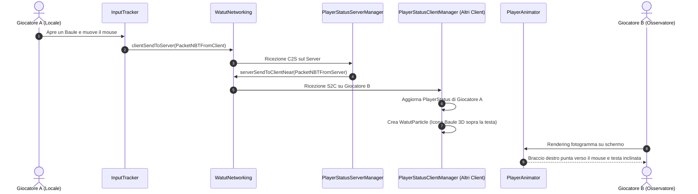

# ARCHITETTURA E GUIDA COMPLETA DEI FILE: WATUT (Minecraft 26.2 Fabric)

Questa guida spiega in dettaglio la struttura, il ruolo di ciascun file e il funzionamento interno di **WATUT** (*"What Are They Up To"*), pensata per sviluppatori di mod Minecraft su **Fabric**.

---

## 📚 Indice
1. [Concetti Fondamentali di Fabric & Minecraft](#1-concetti-fondamentali-di-fabric--minecraft)
2. [Alberatura del Progetto](#2-alberatura-del-progetto)
3. [Guida File per File](#3-guida-file-per-file)
   - [Entrypoints (Radice & Client)](#a-entrypoints)
   - [Modulo `status` (Dati e Stato)](#b-modulo-status)
   - [Modulo `network` (Comunicazione Client ↔ Server)](#c-modulo-network)
   - [Modulo `client.input` (Mouse & Tastiera)](#d-modulo-clientinput)
   - [Modulo `client.animation` (Modello 3D & Interpolazione)](#e-modulo-clientanimation)
   - [Modulo `client.particle` (Particelle & Sprite Atlas)](#f-modulo-clientparticle)
   - [Modulo `client.screen` (Dynamic Screen Streaming)](#g-modulo-clientscreen)
   - [Modulo `client.status` (Client Manager)](#h-modulo-clientstatus)
   - [Modulo `server` (Logica Server & Item Transfer)](#i-modulo-server)
   - [Modulo `config` e `command`](#j-modulo-config-e-command)
   - [Modulo `mixin` (Iniezioni nel codice di Minecraft)](#k-modulo-mixin)
4. [Ciclo di Vita & Diagramma di Flusso](#4-ciclo-di-vita--diagramma-di-flusso)

---

## 1. Concetti Fondamentali di Fabric & Minecraft

Prima di analizzare i file, ecco i concetti cardine del modding moderno:
- **Client vs Server**:
  - *Client*: gestisce la finestra GLFW, il rendering OpenGL, le animazioni dei modelli, le particelle e gli input del giocatore.
  - *Server*: gestisce il mondo, gli inventari reali, le entità e le comunicazioni via rete.
- **Tick Cycle**: Il motore di gioco calcola 20 tick al secondo (1 tick = 50 millisecondi). La grafica gira invece al framerate dello schermo (60, 144+ FPS).
- **Interpolazione Lineare (Lerp)**: Per evitare che le braccia o la testa scattino a 20 FPS, si usa la formula `lerp(factor, prev, target)` che calcola posizioni intermedie fluide tra un tick e l'altro (`partialTicks`).
- **Mixin**: Meccanismo che inietta istruzioni nei metodi originali di Minecraft (es. `Player.tick()`, `PlayerModel.setupAnim()`).
- **Payloads & Codec**: Il sistema moderno di Minecraft/Fabric per scambiare pacchetti tipizzati tra client e server tramite `CustomPacketPayload`.

---

## 2. Alberatura del Progetto

```
WATUT/src/main/java/com/corosus/watut/
├── WatutMod.java                              # Entrypoint comune Fabric
├── client/
│   ├── WatutClientMod.java                    # Entrypoint Client Fabric
│   ├── animation/                             # Calcoli 3D e interpolazione
│   │   ├── PlayerAnimator.java
│   │   ├── Lerpables.java
│   │   └── ModelPartData.java
│   ├── input/                                 # Polling mouse, GUI e tastiera
│   │   └── InputTracker.java
│   ├── particle/                              # Particelle 3D e Sprite Atlas
│   │   ├── WatutParticle.java
│   │   ├── ItemTransferParticle.java
│   │   ├── ParticleRegistry.java
│   │   ├── SpriteInfo.java
│   │   └── SpriteSetPlayer.java
│   ├── screen/                                # Dynamic screen streaming
│   │   ├── RenderHelper.java
│   │   ├── ScreenData.java
│   │   ├── ScreenParticleRenderer.java
│   │   └── ByteBufferProcessor.java
│   └── status/                                # Gestore stato client
│       └── PlayerStatusClientManager.java
├── server/                                    # Gestore stato server
│   ├── PlayerStatusServerManager.java
│   └── ItemTransferDetector.java
├── status/                                    # POJO e strutture dati condivise
│   ├── PlayerStatus.java
│   ├── PlayerGuiState.java
│   ├── PlayerChatState.java
│   ├── InventorySnapshot.java
│   └── FakePlayerHelper.java
├── network/                                   # Networking Fabric
│   ├── WatutNetworking.java
│   ├── PacketNBTFromClient.java
│   └── PacketNBTFromServer.java
├── config/                                    # File e classi di configurazione
│   ├── ConfigClient.java
│   ├── ConfigCommon.java
│   ├── ConfigServerControlledSyncedToClient.java
│   ├── ConfigServerSyncHelper.java
│   └── CustomArmCorrections.java
├── command/                                   # Comandi di gioco (/watut)
│   └── CommandWatutReloadJSON.java
└── mixin/                                     # Iniezioni Mixin
    ├── PlayerTick.java
    ├── PlayerLoggedIn.java
    ├── AbstractContainerMenuDoClick.java
    ├── BlockBehaviorUse.java
    └── client/
        ├── SetupRotationsInject.java
        ├── RenderPingIconInject.java
        ├── GuiRender.java
        ├── KeyboardHandlerKeyPress.java
        ├── MouseHandlerOnPress.java
        ├── MinecraftTick.java
        ├── TextureAtlasUpload.java
        ├── ScreenRenderBackground.java
        └── ScreenRenderWithTooltip.java
```

---

## 3. Guida File per File

### A. Entrypoints

#### [`WatutMod.java`](file:///C:/Users/Alessio/Desktop/SERVER%20minecraft/mod%20minecraft/test%20mod/unofficialfork/WATUT/src/main/java/com/corosus/watut/WatutMod.java)
- **Scopo**: Entrypoint comune di Fabric (`ModInitializer`), eseguito all'avvio sia su Client che su Server.
- **Funzionamento**:
  1. Inizializza i file di configurazione (`ConfigCommon`, `ConfigClient`, `ConfigServerControlledSyncedToClient`).
  2. Genera il file di default `config/watut-item-arm-adjustments.json` e lo carica via `CustomArmCorrections`.
  3. Registra i comandi di gioco (`/watut reloadJSON`).
  4. Registra i tipi di pacchetti (`PayloadTypeRegistry`) e ascolta i pacchetti C2S (Client to Server) tramite `ServerPlayNetworking`.

#### [`WatutClientMod.java`](file:///C:/Users/Alessio/Desktop/SERVER%20minecraft/mod%20minecraft/test%20mod/unofficialfork/WATUT/src/main/java/com/corosus/watut/client/WatutClientMod.java)
- **Scopo**: Entrypoint specifico per il Client (`ClientModInitializer`), eseguito solo nell'ambiente grafico.
- **Funzionamento**: Registra il ricevitore di rete per i pacchetti S2C (Server to Client) tramite `ClientPlayNetworking.registerGlobalReceiver`. Quando arrivano aggiornamenti sugli altri giocatori, li passa al `PlayerStatusClientManager` eseguendoli sul thread di rendering principale (`ctx.client().execute()`).

---

### B. Modulo `status`

#### [`PlayerStatus.java`](file:///C:/Users/Alessio/Desktop/SERVER%20minecraft/mod%20minecraft/test%20mod/unofficialfork/WATUT/src/main/java/com/corosus/watut/status/PlayerStatus.java)
- **Scopo**: Rappresenta lo stato completo di un singolo giocatore.
- **Campi principali**:
  - `playerGuiState`: Quale schermata ha aperta (baule, crafting, fornace, ecc.).
  - `playerChatState`: Se sta digitando o ha la chat aperta.
  - `typingAmplifier`: Velocità/frequenza di battitura per l'animazione delle braccia.
  - `screenPosPercentX` / `Y`: Coordinate normalizzate del mouse dentro la GUI.
  - `ticksSinceLastAction`: Contatore per rilevare lo stato AFK/Idle.
  - `particle` / `particleIdle`: Riferimenti alle particelle 3D create sopra la testa del modello.
  - `lerpTarget` / `lerpPrev`: Dati di posizione e rotazione per l'interpolazione grafica.

#### [`PlayerGuiState.java`](file:///C:/Users/Alessio/Desktop/SERVER%20minecraft/mod%20minecraft/test%20mod/unofficialfork/WATUT/src/main/java/com/corosus/watut/status/PlayerGuiState.java)
- **Scopo**: Enum con tutte le schermate riconosciute (`NONE`, `CHEST`, `INVENTORY`, `CRAFTING`, `FURNACE`, `VILLAGER`, ecc.).
- **Metodi utili**: `isPointingGui()` (indica se la GUI prevede il puntamento del braccio), `isTypingGui()` (se prevede scrittura testo), `isSoundMakerGui()`.

#### [`PlayerChatState.java`](file:///C:/Users/Alessio/Desktop/SERVER%20minecraft/mod%20minecraft/test%20mod/unofficialfork/WATUT/src/main/java/com/corosus/watut/status/PlayerChatState.java)
- **Scopo**: Enum per lo stato della chat (`NONE`, `CHAT_FOCUSED`, `CHAT_TYPING`).

#### [`InventorySnapshot.java`](file:///C:/Users/Alessio/Desktop/SERVER%20minecraft/mod%20minecraft/test%20mod/unofficialfork/WATUT/src/main/java/com/corosus/watut/status/InventorySnapshot.java)
- **Scopo**: Lista di `ItemStack` che fotografa gli oggetti presenti nell'inventario o nel contenitore in un dato momento.

#### [`FakePlayerHelper.java`](file:///C:/Users/Alessio/Desktop/SERVER%20minecraft/mod%20minecraft/test%20mod/unofficialfork/WATUT/src/main/java/com/corosus/watut/status/FakePlayerHelper.java)
- **Scopo**: Individua se un'istanza di `Player` è in realtà un FakePlayer creato da mod di automazione/farm, per escluderlo da calcoli e rendering pesanti.

---

### C. Modulo `network`

#### [`WatutNetworking.java`](file:///C:/Users/Alessio/Desktop/SERVER%20minecraft/mod%20minecraft/test%20mod/unofficialfork/WATUT/src/main/java/com/corosus/watut/network/WatutNetworking.java)
- **Scopo**: Classe centrale per l'invio dei pacchetti Fabric.
- **Funzionamento**:
  - `clientSendToServer(data)`: Spedisce dati dal client al server.
  - `serverSendToClientNear(data, pos, dist, level)`: Spedisce dati dal server solo ai giocatori nel raggio di `dist` blocchi (risparmio di banda).
  - `serverSendToClientAll(data)`: Spedisce dati a tutti i client connessi (es. messaggi globali AFK).

#### [`PacketNBTFromClient.java`](file:///C:/Users/Alessio/Desktop/SERVER%20minecraft/mod%20minecraft/test%20mod/unofficialfork/WATUT/src/main/java/com/corosus/watut/network/PacketNBTFromClient.java) & [`PacketNBTFromServer.java`](file:///C:/Users/Alessio/Desktop/SERVER%20minecraft/mod%20minecraft/test%20mod/unofficialfork/WATUT/src/main/java/com/corosus/watut/network/PacketNBTFromServer.java)
- **Scopo**: Record Java moderni che implementano `CustomPacketPayload` con i relativi identificatori `watut:nbt_server` e `watut:nbt_client`.

---

### D. Modulo `client.input`

#### [`InputTracker.java`](file:///C:/Users/Alessio/Desktop/SERVER%20minecraft/mod%20minecraft/test%20mod/unofficialfork/WATUT/src/main/java/com/corosus/watut/client/input/InputTracker.java)
- **Scopo**: Monitora l'attività dell'utente sul computer locale.
- **Funzionamento**:
  - `detectGuiState(screen)`: Riconosce quale GUI vanilla/moddata è aperta tramite switch pattern matching.
  - `getMousePos()`: Normalizza le coordinate del mouse rispetto alla risoluzione della finestra e alla scala GUI di Minecraft, restituendo un valore tra `-0.75` e `+0.75`.
  - `checkIfTyping(...)`: Confronta la lunghezza del testo digitato nel tempo per calcolare l'intensità della battitura (WPM).

---

### E. Modulo `client.animation`

#### [`PlayerAnimator.java`](file:///C:/Users/Alessio/Desktop/SERVER%20minecraft/mod%20minecraft/test%20mod/unofficialfork/WATUT/src/main/java/com/corosus/watut/client/animation/PlayerAnimator.java)
- **Scopo**: Calcola ed applica le trasformazioni geometriche al modello 3D del giocatore (`PlayerModel`).
- **Funzionamento**:
  1. `setupRotations(...)`: Chiamato dal mixin `SetupRotationsInject` al termine del rendering vanilla di Minecraft.
  2. Puntamento braccio: Orienta il braccio destro verso le coordinate del mouse calcolate nella GUI.
  3. Digitazione: Applica un'oscillazione sinusoidale ritmica alle braccia: `sin(ageInTicks * freq) * amp`.
  4. Inclinazione testa: Fa piegare la testa in avanti (verso la GUI o verso il basso da AFK).
  5. Integrazione con `CustomArmCorrections`: Applica offset o disabilita braccia per armi voluminose (es. scudi o spadoni).

#### [`ModelPartData.java`](file:///C:/Users/Alessio/Desktop/SERVER%20minecraft/mod%20minecraft/test%20mod/unofficialfork/WATUT/src/main/java/com/corosus/watut/client/animation/ModelPartData.java) & [`Lerpables.java`](file:///C:/Users/Alessio/Desktop/SERVER%20minecraft/mod%20minecraft/test%20mod/unofficialfork/WATUT/src/main/java/com/corosus/watut/client/animation/Lerpables.java)
- **Scopo**: Strutture dati che contengono le coordinate `x, y, z` e gli angoli `xRot, yRot, zRot` di testa, braccia e gambe, fornendo il metodo `copyPartialLerp()` per l'interpolazione a 60+ FPS.

---

### F. Modulo `client.particle`

#### [`WatutParticle.java`](file:///C:/Users/Alessio/Desktop/SERVER%20minecraft/mod%20minecraft/test%20mod/unofficialfork/WATUT/src/main/java/com/corosus/watut/client/particle/WatutParticle.java)
- **Scopo**: Particella 3D unificata per le icone sopra la testa del giocatore.
- **Funzionamento**:
  - Estende `SingleQuadParticle`.
  - Ruota nello spazio tridimensionale tramite quaternioni (`Quaternionf`).
  - Renderizza entrambi i lati del quad (Double-Sided) per essere visibile sia frontalmente che da dietro le spalle.
  - Supporta animazioni temporizzate (`SpriteSetPlayer`) e riduzione automatica della risoluzione in base alla distanza dalla telecamera (LoD).

#### [`ItemTransferParticle.java`](file:///C:/Users/Alessio/Desktop/SERVER%20minecraft/mod%20minecraft/test%20mod/unofficialfork/WATUT/src/main/java/com/corosus/watut/client/particle/ItemTransferParticle.java)
- **Scopo**: Disegna l'oggetto 3D che vola dal baule verso il giocatore (o viceversa) durante le azioni di inventario.

#### [`ParticleRegistry.java`](file:///C:/Users/Alessio/Desktop/SERVER%20minecraft/mod%20minecraft/test%20mod/unofficialfork/WATUT/src/main/java/com/corosus/watut/client/particle/ParticleRegistry.java), [`SpriteInfo.java`](file:///C:/Users/Alessio/Desktop/SERVER%20minecraft/mod%20minecraft/test%20mod/unofficialfork/WATUT/src/main/java/com/corosus/watut/client/particle/SpriteInfo.java), [`SpriteSetPlayer.java`](file:///C:/Users/Alessio/Desktop/SERVER%20minecraft/mod%20minecraft/test%20mod/unofficialfork/WATUT/src/main/java/com/corosus/watut/client/particle/SpriteSetPlayer.java)
- **Scopo**: Registrano gli identificatori delle texture nell'atlas delle particelle di Minecraft e gestiscono il ciclo di avanzamento dei fotogrammi.

---

### G. Modulo `client.screen`

#### [`DynamicScreenManager.java`](file:///C:/Users/Alessio/Desktop/SERVER%20minecraft/mod%20minecraft/test%20mod/unofficialfork/WATUT/src/main/java/com/corosus/watut/client/screen/DynamicScreenManager.java)
- **Scopo**: Gestore per la cattura hardware GPU-safe dell'area GUI attiva, aspect ratio dinamico e delta detection (CRC32).
- **Funzionamento**:
  1. Tramite [`AbstractContainerScreenAccessor.java`](file:///C:/Users/Alessio/Desktop/SERVER%20minecraft/mod%20minecraft/test%20mod/unofficialfork/WATUT/src/main/java/com/corosus/watut/mixin/client/AbstractContainerScreenAccessor.java), estrae `leftPos`, `topPos`, `imageWidth` e `imageHeight` e ritaglia con precisione millimetrica il perimetro della GUI aperta in coordinate fisiche (`* guiScale`).
  2. Esegue la cattura asincrona con `Screenshot.takeScreenshot(mc.gameRenderer.mainRenderTarget(), ...)`.
  3. Calcola l'hash CRC32 per rilevare se ci sono modifiche visive (es. fiamma fornace, oggetti spostati, cursore, cambio inventario).
  4. Invia i buffer al thread asincrono `ByteBufferProcessor` per la compressione `Deflater` e trasmette `width`/`height` come metadati nel pacchetto.

#### [`DynamicScreenRenderer.java`](file:///C:/Users/Alessio/Desktop/SERVER%20minecraft/mod%20minecraft/test%20mod/unofficialfork/WATUT/src/main/java/com/corosus/watut/client/screen/DynamicScreenRenderer.java)
- **Scopo**: Renderer 3D olografico per proiettare a mezz'aria lo schermo reale in Minecraft 26.2 (Fabric).
- **Funzionamento**:
  1. Registrato su `LevelRenderEvents.AFTER_TRANSLUCENT_FEATURES`.
  2. Scala il Quad in base all'Aspect Ratio reale (`width / height`), adattandosi a casse doppie, singole, fornaci, anvil o mod.
  3. **Culling Unilaterale Antighosting**: Calcola `toCamera.dot(frontNormal)` disegnando solo la faccia rivolta all'osservatore (frontale se davanti, posteriore raddrizzata se dietro), eliminando qualsiasi sovrapposizione o effetto specchio.
  4. Applica dissolvenza di prossimità (alpha fading) tra 7 e 10 blocchi.
  5. Renderizza il cursore del mouse sincronizzato sia sulla vista frontale che posteriore.

#### [`RenderHelper.java`](file:///C:/Users/Alessio/Desktop/SERVER%20minecraft/mod%20minecraft/test%20mod/unofficialfork/WATUT/src/main/java/com/corosus/watut/client/screen/RenderHelper.java) & [`ScreenData.java`](file:///C:/Users/Alessio/Desktop/SERVER%20minecraft/mod%20minecraft/test%20mod/unofficialfork/WATUT/src/main/java/com/corosus/watut/client/screen/ScreenData.java)
- **Scopo**: Pipeline di decompressione `Inflater`, buffer GPU persistente a 256x256 e gestione sicura della memoria 100% Java heap (zero `MemoryUtil`).
- **GpuTextureView Safety**: Alloca una sola texture per giocatore con `upload()` immediato, prevenendo deallocazioni e crash `IllegalStateException: Texture view does not exist`.

---

### H. Modulo `client.status`

#### [`PlayerStatusClientManager.java`](file:///C:/Users/Alessio/Desktop/SERVER%20minecraft/mod%20minecraft/test%20mod/unofficialfork/WATUT/src/main/java/com/corosus/watut/client/status/PlayerStatusClientManager.java)
- **Scopo**: Il controller principale lato Client.
- **Funzionamento**:
  - Ad ogni tick raccoglie le modifiche del player locale (mouse, GUI, digitazione) e le invia al server.
  - Gestisce la creazione, l'aggiornamento e la rimozione delle particelle per tutti gli altri player vicini.
  - Riproduce effetti sonori (click mouse, apertura GUI).
  - Gestisce l'icona AFK nella lista tab dei giocatori (`extractPingIconHook`).

---

### I. Modulo `server`

#### [`PlayerStatusServerManager.java`](file:///C:/Users/Alessio/Desktop/SERVER%20minecraft/mod%20minecraft/test%20mod/unofficialfork/WATUT/src/main/java/com/corosus/watut/server/PlayerStatusServerManager.java)
- **Scopo**: Il controller principale lato Server.
- **Funzionamento**:
  - Riceve i pacchetti inviati dai singoli client, inserisce l'UUID del giocatore mittente e li re-inoltra a tutti i client nei dintorni.
  - Gestisce la transizione allo stato Idle/AFK annunciando il messaggio nella chat del server.
  - Quando un giocatore effettua il login, gli invia l'ultimo stato noto di tutti i giocatori presenti.

#### [`ItemTransferDetector.java`](file:///C:/Users/Alessio/Desktop/SERVER%20minecraft/mod%20minecraft/test%20mod/unofficialfork/WATUT/src/main/java/com/corosus/watut/server/ItemTransferDetector.java)
- **Scopo**: Analizza le differenze tra lo stato degli inventari prima e dopo un click (`PICKUP` o `QUICK_MOVE` con shift), calcola quale oggetto è stato trasferito e invia il pacchetto per visualizzare l'effetto particellare.

---

### J. Modulo `config` e `command`

- [**`ConfigClient.java`**](file:///C:/Users/Alessio/Desktop/SERVER%20minecraft/mod%20minecraft/test%20mod/unofficialfork/WATUT/src/main/java/com/corosus/watut/config/ConfigClient.java): Opzioni client (visibilità animazioni, suoni, scala particelle, privacy).
- [**`ConfigCommon.java`**](file:///C:/Users/Alessio/Desktop/SERVER%20minecraft/mod%20minecraft/test%20mod/unofficialfork/WATUT/src/main/java/com/corosus/watut/config/ConfigCommon.java): Opzioni condivise (durata tick per andare AFK, annunci chat).
- [**`ConfigServerControlledSyncedToClient.java`**](file:///C:/Users/Alessio/Desktop/SERVER%20minecraft/mod%20minecraft/test%20mod/unofficialfork/WATUT/src/main/java/com/corosus/watut/config/ConfigServerControlledSyncedToClient.java): Impostazioni del server sincronizzate con priorità sui client.
- [**`ConfigServerSyncHelper.java`**](file:///C:/Users/Alessio/Desktop/SERVER%20minecraft/mod%20minecraft/test%20mod/unofficialfork/WATUT/src/main/java/com/corosus/watut/config/ConfigServerSyncHelper.java): Utility di serializzazione automatica via reflection per sincronizzare le impostazioni server.
- [**`CustomArmCorrections.java`**](file:///C:/Users/Alessio/Desktop/SERVER%20minecraft/mod%20minecraft/test%20mod/unofficialfork/WATUT/src/main/java/com/corosus/watut/config/CustomArmCorrections.java): Parser Gson del file JSON per regole personalizzate di orientamento braccia in base all'oggetto impugnato.
- [**`CommandWatutReloadJSON.java`**](file:///C:/Users/Alessio/Desktop/SERVER%20minecraft/mod%20minecraft/test%20mod/unofficialfork/WATUT/src/main/java/com/corosus/watut/command/CommandWatutReloadJSON.java): Comando Brigadier `/watut reloadJSON` per ricaricare le regole a caldo.

---

### K. Modulo `mixin`

| Mixin | Target Vanilla | Scopo |
| :--- | :--- | :--- |
| [**`PlayerTick.java`**](file:///C:/Users/Alessio/Desktop/SERVER%20minecraft/mod%20minecraft/test%20mod/unofficialfork/WATUT/src/main/java/com/corosus/watut/mixin/PlayerTick.java) | `Player.tick()` | Esegue il ciclo di aggiornamento periodico sia su client che su server. |
| [**`PlayerLoggedIn.java`**](file:///C:/Users/Alessio/Desktop/SERVER%20minecraft/mod%20minecraft/test%20mod/unofficialfork/WATUT/src/main/java/com/corosus/watut/mixin/PlayerLoggedIn.java) | `PlayerList.placeNewPlayer()` | Sincronizza lo stato degli altri giocatori al momento del login. |
| [**`AbstractContainerMenuDoClick.java`**](file:///C:/Users/Alessio/Desktop/SERVER%20minecraft/mod%20minecraft/test%20mod/unofficialfork/WATUT/src/main/java/com/corosus/watut/mixin/AbstractContainerMenuDoClick.java) | `AbstractContainerMenu.clicked()` | Intercetta i click prima e dopo l'elaborazione per rilevare lo spostamento di item. |
| [**`BlockBehaviorUse.java`**](file:///C:/Users/Alessio/Desktop/SERVER%20minecraft/mod%20minecraft/test%20mod/unofficialfork/WATUT/src/main/java/com/corosus/watut/mixin/BlockBehaviorUse.java) | `BlockStateBase.useItemOn()` | Registra quale blocco (es. baule) è stato aperto con il tasto destro. |
| [**`SetupRotationsInject.java`**](file:///C:/Users/Alessio/Desktop/SERVER%20minecraft/mod%20minecraft/test%20mod/unofficialfork/WATUT/src/main/java/com/corosus/watut/mixin/client/SetupRotationsInject.java) | `PlayerModel.setupAnim()` | **Punto chiave**: Modifica le rotazioni di braccia e testa del modello 3D del player. |
| [**`RenderPingIconInject.java`**](file:///C:/Users/Alessio/Desktop/SERVER%20minecraft/mod%20minecraft/test%20mod/unofficialfork/WATUT/src/main/java/com/corosus/watut/mixin/client/RenderPingIconInject.java) | `PlayerTabOverlay.extractPingIcon()` | Disegna l'icona Zzz al posto delle barre di ping nella Tab List. |
| [**`GuiRender.java`**](file:///C:/Users/Alessio/Desktop/SERVER%20minecraft/mod%20minecraft/test%20mod/unofficialfork/WATUT/src/main/java/com/corosus/watut/mixin/client/GuiRender.java) | `Gui.extractRenderState()` | Disegna l'overlay "Player is typing..." in chat. |
| [**`KeyboardHandlerKeyPress.java`**](file:///C:/Users/Alessio/Desktop/SERVER%20minecraft/mod%20minecraft/test%20mod/unofficialfork/WATUT/src/main/java/com/corosus/watut/mixin/client/KeyboardHandlerKeyPress.java) | `KeyboardHandler.keyPress()` | Reset dello stato AFK alla pressione di un tasto. |
| [**`MouseHandlerOnPress.java`**](file:///C:/Users/Alessio/Desktop/SERVER%20minecraft/mod%20minecraft/test%20mod/unofficialfork/WATUT/src/main/java/com/corosus/watut/mixin/client/MouseHandlerOnPress.java) | `MouseHandler.onButton()` | Muove il braccio e resetta l'AFK al click del mouse. |
| [**`MinecraftTick.java`**](file:///C:/Users/Alessio/Desktop/SERVER%20minecraft/mod%20minecraft/test%20mod/unofficialfork/WATUT/src/main/java/com/corosus/watut/mixin/client/MinecraftTick.java) | `Minecraft.tick()` | Esegue il ciclo client generale per pulire player disconnessi. |
| [**`TextureAtlasUpload.java`**](file:///C:/Users/Alessio/Desktop/SERVER%20minecraft/mod%20minecraft/test%20mod/unofficialfork/WATUT/src/main/java/com/corosus/watut/mixin/client/TextureAtlasUpload.java) | `TextureAtlas.upload()` | Inizializza gli sprite di WATUT quando Minecraft carica l'atlas particelle. |
| [**`ScreenRenderBackground.java`**](file:///C:/Users/Alessio/Desktop/SERVER%20minecraft/mod%20minecraft/test%20mod/unofficialfork/WATUT/src/main/java/com/corosus/watut/mixin/client/ScreenRenderBackground.java) & [**`ScreenRenderWithTooltip.java`**](file:///C:/Users/Alessio/Desktop/SERVER%20minecraft/mod%20minecraft/test%20mod/unofficialfork/WATUT/src/main/java/com/corosus/watut/mixin/client/ScreenRenderWithTooltip.java) | `Screen` | Hook grafici per il rendering dynamic screen. |

---

## 4. Ciclo di Vita & Diagramma di Flusso


