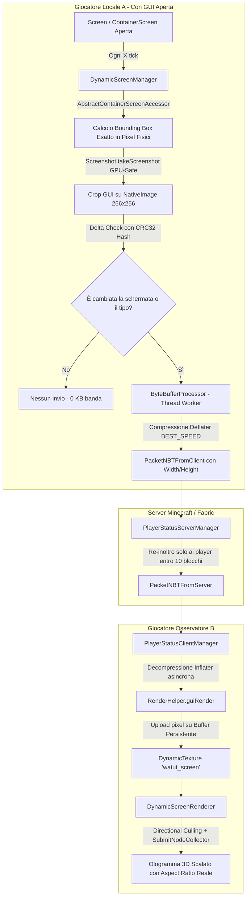

# 📜 Report Tecnico: Architettura e Implementazione del Live Dynamic Screen (Strada B)

Questo report documenta in dettaglio l'architettura, la pipeline grafica, il flusso di rete, i file coinvolti e le soluzioni tecniche adottate per implementare lo **streaming in tempo reale della GUI (Live Dynamic Screen)** in **WATUT** su **Minecraft 26.2 (Fabric)**.

---

## 🎯 1. Obiettivo del Progetto

Permettere agli altri giocatori nel server/mondo di visualizzare **in tempo reale e a mezz'aria (in 3D)** l'esatta schermata che un giocatore sta guardando (inclusi forni con fiamme accese, barre di avanzamento, casse singole e doppie, enderchest, shulker box, tavoli da lavoro, ricettari, incudini e GUI di mod terze), con proporzioni dinamiche esatte e sincronizzazione in tempo reale del **cursore del mouse**.

---

## 🏗️ 2. Panoramica dell'Architettura

---

## 📂 3. Mappa dei File e Responsabilità

### 1. [`DynamicScreenManager.java`](file:///C:/Users/Alessio/Desktop/SERVER%20minecraft/mod%20minecraft/test%20mod/unofficialfork/WATUT/src/main/java/com/corosus/watut/client/screen/DynamicScreenManager.java)
* **Ruolo**: Cattura dello schermo locale, rilevamento modifiche visive e calcolo delle proporzioni esatte.
* **Cosa fa**:
  1. **Proximity Check**: Controlla se ci sono altri giocatori connessi entro `distanceRequiredToShowGUIInfo` (10 blocchi). Se sei da solo, non consuma risorse.
  2. **Rilevamento Bounding Box Dinamico**: Tramite [`AbstractContainerScreenAccessor.java`](file:///C:/Users/Alessio/Desktop/SERVER%20minecraft/mod%20minecraft/test%20mod/unofficialfork/WATUT/src/main/java/com/corosus/watut/mixin/client/AbstractContainerScreenAccessor.java), estrae `leftPos`, `topPos`, `imageWidth` e `imageHeight` e li converte in coordinate fisiche tramite `guiScale`.
  3. **Cattura GPU-Safe**: Utilizza `Screenshot.takeScreenshot(mc.gameRenderer.mainRenderTarget(), fullImage -> ...)` che sfrutta il `CommandEncoder` nativo di Minecraft 26.2 senza bloccare il thread di rendering principale.
  4. **Delta-Check con CRC32**: Calcola l'hash a 64-bit del fotogramma. Se la fiamma della fornace non si è mossa e il cursore è fermo, l'hash coincide e **il frame viene scartato**, azzerando il carico di rete.

### 2. [`ByteBufferProcessor.java`](file:///C:/Users/Alessio/Desktop/SERVER%20minecraft/mod%20minecraft/test%20mod/unofficialfork/WATUT/src/main/java/com/corosus/watut/client/screen/ByteBufferProcessor.java)
* **Ruolo**: Compressione asincrona in background.
* **Cosa fa**:
  * Riceve i frame catturati su una coda non bloccante.
  * Esegue la compressione `Deflater` con livello `BEST_SPEED` su un thread separato.
  * Riduce ogni fotogramma da **~256 KB non compressi** a soli **~3-5 KB compressi**.

### 3. [`RenderHelper.java`](file:///C:/Users/Alessio/Desktop/SERVER%20minecraft/mod%20minecraft/test%20mod/unofficialfork/WATUT/src/main/java/com/corosus/watut/client/screen/RenderHelper.java)
* **Ruolo**: Pipeline di decompressione, gestione del buffer GPU persistente e upload.
* **Cosa fa**:
  * Decomprime i byte ricevuti tramite `Inflater`.
  * **Buffer GPU Persistente**: Alloca una sola volta una `DynamicTexture` 256x256 per giocatore con `upload()` immediato, garantendo che la `GpuTextureView` sia sempre valida ed evitando crash di deallocazione al cambio di interfaccia.
  * Scrive i pixel nel puntatore `NativeImage.getPixelBytes()` in modo 100% gestito da Java, senza fare uso di puntatori grezzi JNI (`MemoryUtil.memAlloc`/`memFree`).

### 4. [`DynamicScreenRenderer.java`](file:///C:/Users/Alessio/Desktop/SERVER%20minecraft/mod%20minecraft/test%20mod/unofficialfork/WATUT/src/main/java/com/corosus/watut/client/screen/DynamicScreenRenderer.java)
* **Ruolo**: Disegno dell'ologramma 3D nel mondo di gioco con Aspect Ratio reale e Culling direzionale.
* **Cosa fa**:
  * Registrato sull'evento ufficiale Fabric 26.2: `LevelRenderEvents.AFTER_TRANSLUCENT_FEATURES`.
  * **Aspect Ratio Adattivo**: Calcola `aspectRatio = screenData.getWidth() / screenData.getHeight()` per scalare le dimensioni geometriche del Quad (`widthHalf`, `heightHalf`) in base all'interfaccia (es. proporzioni allungate per cassa doppia, quadrate per cassa singola o fornace).
  * **Culling Unilaterale Antighosting**: Calcola il prodotto scalare tra il vettore visuale della telecamera e la normale dell'ologramma (`toCamera.dot(frontNormal)`):
    * Se l'osservatore è davanti: disegna **esclusivamente la faccia frontale**.
    * Se l'osservatore è dietro: disegna **esclusivamente la faccia posteriore raddrizzata** (leggibile da sinistra a destra, non specchiata).
    * Zero sovrapposizioni o sdoppiamento di texture traslucide.
  * **Cursore del Mouse**: Calcola la posizione relativa `(screenPosPercentX, screenPosPercentY)` e disegna un puntatore 3D separato sincronizzato sopra la superficie della GUI (sia sul fronte che sul retro).
  * **Proximity Fade**: Applica una dissolvenza morbida dell'alpha tra 7 e 10 blocchi di distanza.

### 5. [`PlayerStatusClientManager.java`](file:///C:/Users/Alessio/Desktop/SERVER%20minecraft/mod%20minecraft/test%20mod/unofficialfork/WATUT/src/main/java/com/corosus/watut/client/status/PlayerStatusClientManager.java)
* **Ruolo**: Coordinatore lato client di rete, tick loop, particelle di digitazione e LoD.
* **Cosa fa**:
  * In `tickGame()`: richiama `RenderHelper.guiRender()` per processare i buffer ricevuti e `DynamicScreenManager.tryCaptureCurrentScreen()`.
  * In `tickOtherPlayer()`: gestisce la mutua esclusione LoD tra schermo dinamico dei container e particelle di chat (`CHAT_TYPING` coi puntini animati `...` / `CHAT_IDLE`).
  * In `renderChatTypingOverlay()`: disegna in tempo reale la notifica `"<Giocatore> is typing..."` sopra la barra di inserimento della chat quando l'altro giocatore sta scrivendo.

### 6. [`ScreenData.java`](file:///C:/Users/Alessio/Desktop/SERVER%20minecraft/mod%20minecraft/test%20mod/unofficialfork/WATUT/src/main/java/com/corosus/watut/client/screen/ScreenData.java)
* **Ruolo**: Modello dati associato ad ogni giocatore.
* **Cosa fa**: Mantiene lo stato della schermata, le dimensioni logiche per l'Aspect Ratio (`width`, `height`), l'identificatore univoco della texture (`Identifier.fromNamespaceAndPath("watut", "screen_" + uuid)`), il flag thread-safe `textureReady`, l'hash del frame precedente e la logica di cleanup.

---

## 🛠️ 4. Riepilogo Risoluzione Problemi e Crash

| Problema Risolto | Causa Tecnica | Soluzione Adottata |
|---|---|---|
| **Crash all'Avvio (`IConfigSpec`)** | Il vecchio `.jar` di CoroUtil nel launcher conteneva ancora dipendenze da Forge. | Riscrittura del config loader in puro Fabric TOML con Java NIO e ricompilazione totale. |
| **Crash Nativo `jemalloc.dll` (0xc0000005)** | Chiamate `MemoryUtil.memAlloc`/`memFree` su buffer Java gestiti dal garbage collector. | Rimozione totale di `MemoryUtil`. Uso esclusivo di `NativeImage.getPixelBytes()` e `ByteArrayOutputStream`. |
| **Crash OpenGL / Framegraph** | Tentativo di fare `GL11.glReadPixels` durante la fase di estrazione GUI. | Adozione della pipeline GPU nativa `Screenshot.takeScreenshot(...)` con `CommandEncoder`. |
| **Crash al Cambio GUI (`Texture view does not exist`)** | Deallocazione della `GpuTextureView` dovuta alla ricreazione dinamica delle texture ad ogni cambio inventario. | Architettura a Texture Buffer persistente a 256x256 con aspect ratio gestito geometricamente nel Quad. |
| **Flickering della GUI in Multiplayer** | Conflitto di rendering tra la particella LoD statica e l'ologramma dinamico. | Mutua esclusione in `PlayerStatusClientManager`: soppressione delle particelle statiche quando la texture dinamica è attiva. |
| **GUI Posteriore Specchiata e Sovrapposta** | Doppio invio contemporaneo di due facce traslucide a coordinate coincidenti. | Culling direzionale in base alla posizione della telecamera e inversione dell'asse X sui vertici posteriori per raddrizzare la vista. |
| **Digitazione Incudine (`AnvilScreen`)** | Mancanza dell'hook sull'evento GLFW `charTyped` in Minecraft 26.2 e mancato focus tracking. | Aggiunto `@Inject` su `KeyboardHandler.charTyped` e registrata la casella di testo dell'incudine in `InputTracker` e `accesswidener`. |
| **Fumetto Animato e Notifica Chat** | Texture persistente che bloccava erroneamente lo spawn delle particelle di digitazione. | Isolamento dello stato `CHAT_SCREEN` e implementazione di `renderChatTypingOverlay` per la notifica `"Player is typing..."`. |
